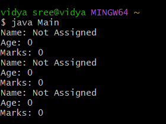

# java-lab-cse-g-5ef-3a
experiment-3a
## experiment-3a 
# implementation of constructor overloading in java 
source code : 
java 
```
(LOGIC FILE)
class Student {
    String name;
    int age;
    int marks;
Student() {
        name = "Not Assigned";
    }

Student(String n, int a) {
        name = n;
        age = a;
    }

    Student(String n, int a, int m) {
   name = n;
age = a;
 marks = m;
    }
 void display() {
 System.out.println("Name: " + name + "\nAge: " + age + "\nMarks: " + marks);
    }
}
(MAIN FILE)

public class Main {
    public static void main(String[] args) {
        Student s1 = new Student();

        Student s2 = new Student();
        Student s3 = new Student();
        s1.display();
        s2.display();
        s3.display();
    }
}


```
# output:

